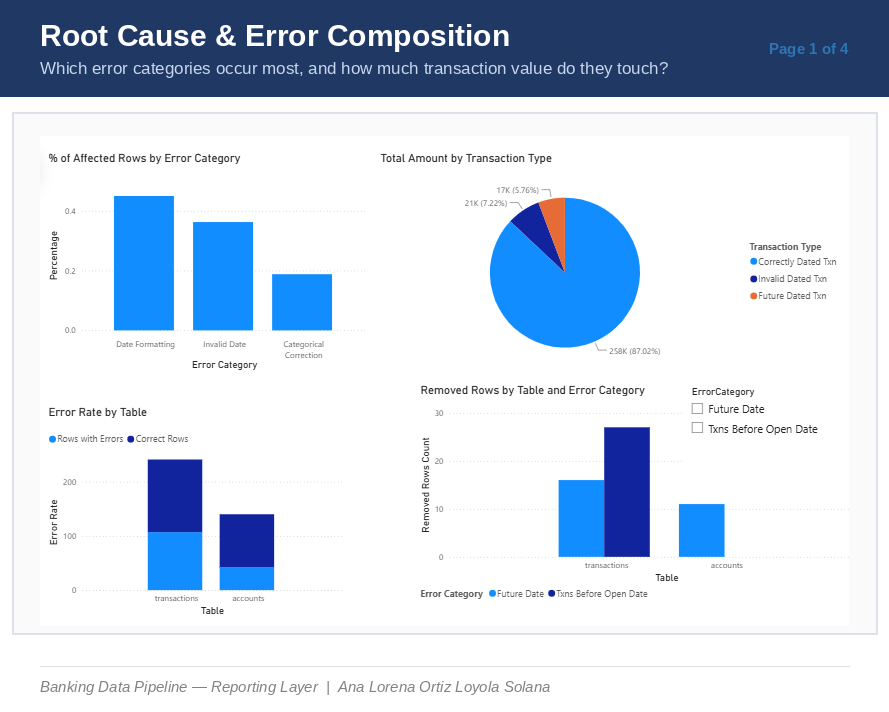
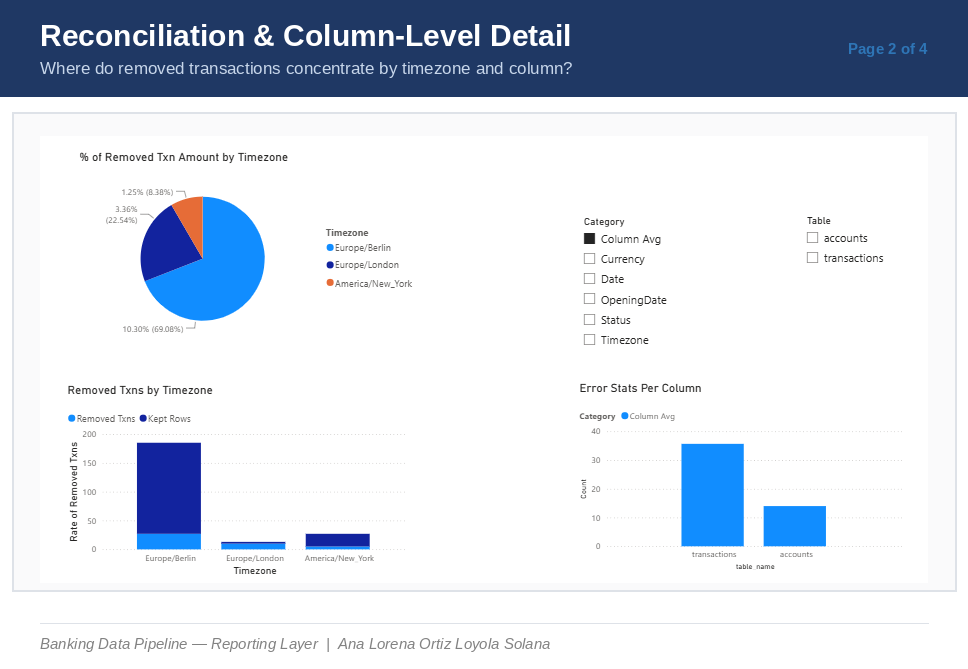
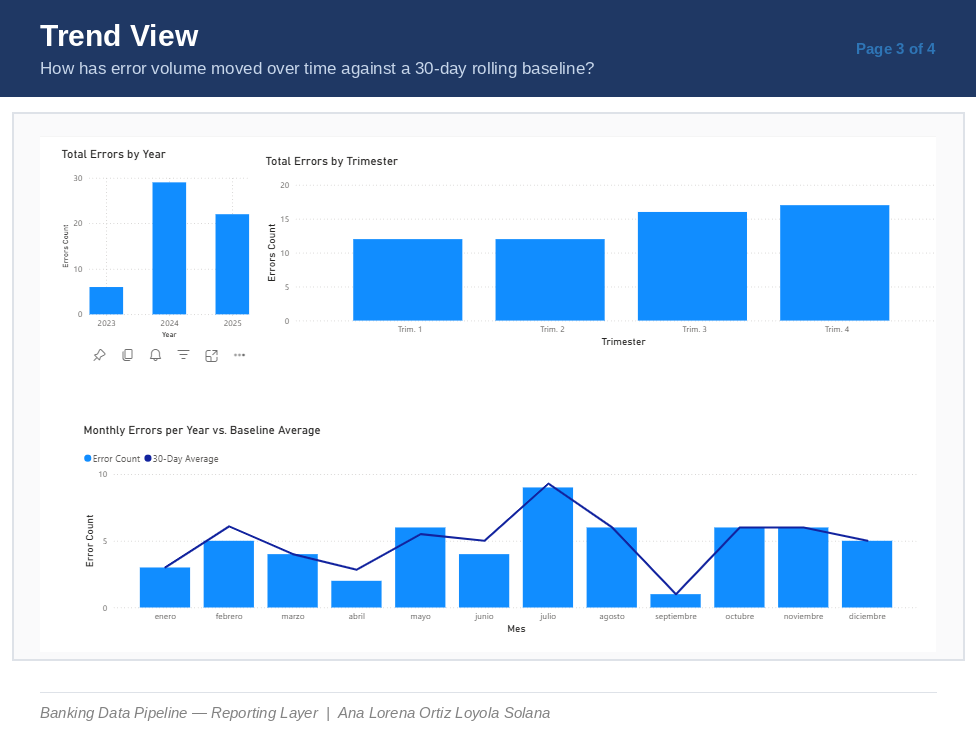
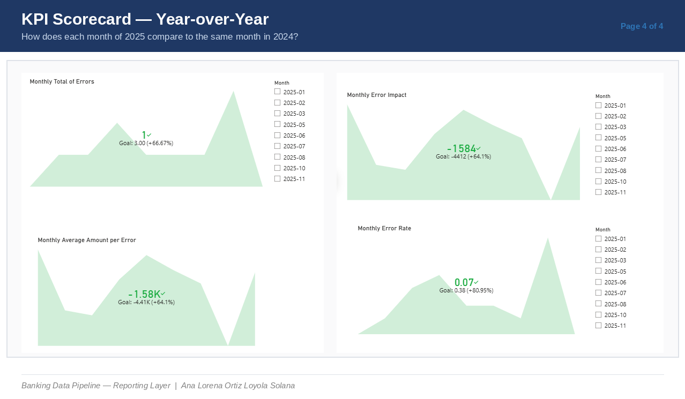

# Banking Data Pipeline - Data Cleaning, Audit Log & Reporting Layer

[](https://github.com/LorenaOrtizSolana/pipeline/actions/workflows/pipeline.yml)

**Author:** Lorena Ortiz Solana
**Role:** Data Science / Analytics Candidate (Bachelor Level)
**Focus:** Fintech / Banking - Data Quality, SQL, Python, Power BI, Auditability

## Project Overview

This project simulates an end-to-end data pipeline for banking transactions. It is designed to demonstrate skills that are directly relevant for banks and fintechs:

- Generating realistic transaction data with intentional errors
- Loading data into a normalized SQLite database with foreign keys
- Cleaning the data step by step (duplicates, nulls, future dates, typos)
- Recording every change in a cleaning log for full auditability
- Reporting on data quality and financial impact in an interactive Power BI dashboard

The pipeline is reproducible (fixed random seed), idempotent, and includes an exception report for manual review.

## Pipeline Structure

| Script | Purpose |
|--------|---------|
| `create-csv.py` | Simulates 150 accounts and transactions with realistic errors (nulls, duplicates, wrong formats, future dates). Uses seed(42). |
| `sql-filltables.py` | Creates SQLite tables (accounts, transactions) with foreign keys and inserts the CSV data. Saves original copies as `orig_accounts` and `orig_transactions`. |
| `sql-duplicates.py` | Detects and moves duplicate transactions (same account and same date) to a separate table. |
| `sql-empty.py` | Handles NULL and empty strings. Imputes missing timezones based on dates. Removes rows with too many missing fields. |
| `sql-cleaning.py` | Collects the distinct values present in categorical columns (`Status`, `Currency`, `AccountTypeCode`, `Timezone`, `DebitCredit`) as a reference step ahead of fuzzy-matching cleanup. |
| `function_cleaning.py` | Core cleaning logic: fixes date formats, corrects categorical values with fuzzy matching, moves future and invalid dates to error tables, and logs every change to `cleaning_log`. |
| `balance.py` | Maintains account balances via SQL triggers on insert, update, and delete of transactions. |
| `log.py` | Reads the `cleaning_log` table, generates summary statistics, exception report, and data quality visualizations. |
| `main.py` | Orchestrates the full pipeline end to end, running each script in order and stopping on the first failure. |

## What the Cleaning Log Captures

For each change, the log records:

- Table and row ID
- Column name
- Original value to new value
- Action (corrected, removed, set_null)
- Reason (e.g., "Value not in allowed list")
- Timestamp

This is auditor-ready.

## Outputs (saved in cleaning_reports folder)

| File | Description |
|------|-------------|
| `summary_report.txt` | Text summary of total changes, most cleaned table and column, etc. |
| `exception_report.txt` | Human-readable report (English and Spanish) grouped by error type. |
| `cleaning_log_export.csv` | Full log as CSV. |
| `1_changes_by_table.png` | Bar chart of changes per table. |
| `2_changes_by_column.png` | Bar chart of changes per column (top 10). |
| `3_actions_pie.png` | Pie chart of action types (corrected vs removed). |
| `4_changes_over_time.png` | Cleaning activity over time (if multiple runs). |
| `5_heatmap_table_action.png` | Heatmap showing which tables required which actions. |

## How to Run the Pipeline

### 1. Requirements

```bash
pip install pandas matplotlib seaborn python-dateutil pytz
```

### 2. Run

```bash
python main.py
```

This runs the full pipeline in order — data generation, table creation, deduplication, null handling, categorical cleaning, date/status correction, balance calculation, and log/report generation — stopping immediately if any step fails. Individual scripts can also be run standalone (e.g., to re-run only `function_cleaning.py` after a manual data tweak), provided `test_db.db` already has the required tables populated by the earlier steps.

### 3. Inspect the results

- Raw audit trail: query the `cleaning_log` table directly in `test_db.db`, or open `cleaning_reports/cleaning_log_export.csv`.
- Summary stats and visuals: see the `cleaning_reports/` folder generated by `log.py`.
- Interactive reporting: open `12-aug-powerbi.pbix` in Power BI Desktop (see below).

## Reporting Layer (Power BI)

`12-aug-powerbi.pbix` turns the `cleaning_log` audit trail into a 4-page 
interactive report answering: **what are the main root causes of 
data-quality errors, and what is their financial impact in terms of 
dropped transactions?**






- **Page 1 — Root Cause & Composition:** error category breakdown (date formatting, invalid dates, categorical corrections), transaction value by status, error rate by table, removed rows by root cause.
- **Page 2 — Reconciliation:** removed transaction value by timezone, removed-vs-kept rate by timezone, average errors per column by table — mirrors cross-jurisdiction reconciliation work in regulatory reporting.
- **Page 3 — Trend:** total errors by year and by quarter, monthly error count plotted against a 30-day rolling baseline computed with custom DAX (not a built-in time-intelligence function).
- **Page 4 — KPI Scorecard:** month-over-same-month-prior-year comparison for error count, error rate, and financial impact, with a fallback to the prior year's average when no directly comparable month exists.

Key DAX patterns used: `SWITCH(TRUE())` for reason-code categorization, `GROUPBY`/`GENERATE` for per-table per-category aggregation, `SELECTCOLUMNS`/`UNION` for reconciling split transaction tables, and custom rolling-window / prior-year-comparison measures built with `CALCULATE`, `SELECTEDVALUE`, and `AVERAGEX`.

See `Power_BI_Case_Study.docx` for the full write-up, including the data model, DAX approach, and production-scope limitations.

## Limitations & Production Scope

This is a proof-of-concept built on synthetic data, scoped that way intentionally. For a production deployment, this would additionally need:

- Row-level security by reporting entity
- Incremental refresh instead of full reloads as `cleaning_log` and transaction tables grow
- Automated data-quality alerting when the error rate exceeds the rolling baseline by a defined threshold
- A proper shared date/calendar table relating year-over-year aggregates, replacing the current per-year tables joined on text-matched `YearMonth` keys
