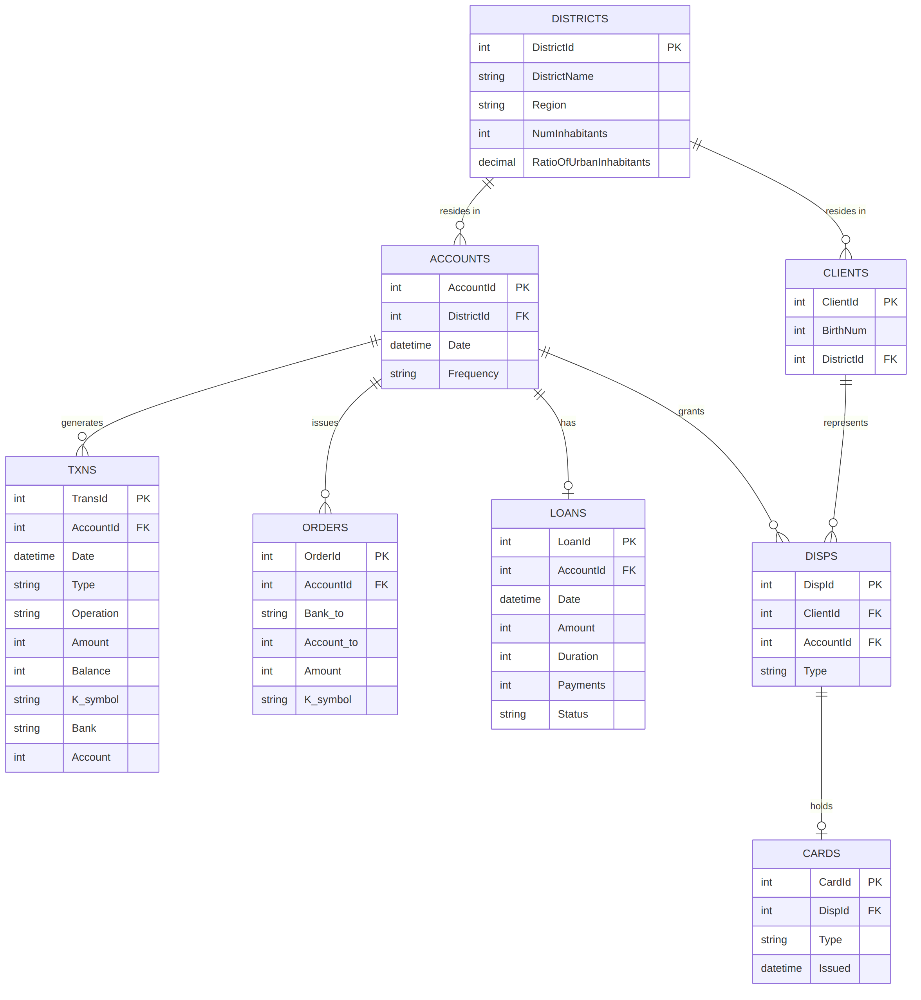

# Berka SQL Module

This module extends the banking pipeline with analytical SQL against a real, anonymized dataset: the Berka Czech Financial Dataset (PKDD'99).

## Schema

| Table | Purpose | Rows |
|-------|---------|-----:|
| `accounts` | One row per bank account, with statement frequency | 4,500 |
| `txns` | Every transaction on every account | 1,056,320 |
| `orders` | Standing payment orders | 6,471 |
| `loans` | Loans granted, with repayment status | 682 |
| `cards` | Credit cards issued | 892 |
| `clients` | Bank customers | 5,369 |
| `disps` | Links clients to accounts (owner/disponent) | 5,369 |
| `districts` | Demographic data per district | 77 |

Row counts are from `load_berka.py` output.

## Data integrity

After loading, every foreign key relationship was checked for orphaned rows
(`txns→accounts`, `disps→accounts`, `disps→clients`, `cards→disps`,
`loans→accounts`, `orders→accounts`, `accounts→districts`, `clients→districts`).
All returned 0. The loader runs these checks on every load.

## Setup

1. Download the Berka dataset (mirrored on Kaggle) and place the CSVs in `queries/data/`:
   `account.csv`, `trans.csv`, `order.csv`, `loan.csv`, `district.csv`,
   `card.csv`, `client.csv`, `disp.csv`
2. From the repo root, run: `python queries/setup/load_berka.py`
3. Expected output: one `table: N rows` line per table, matching the counts above,
   then eight orphan checks that should each end in `-> 0`.

The database is written to `queries/setup/berka_db.db`. Neither the CSVs nor the
database are committed to git. Queries are numbered `01_` to `06_` and target
`berka_db.db`; the synthetic pipeline's `test_db.db` is separate.